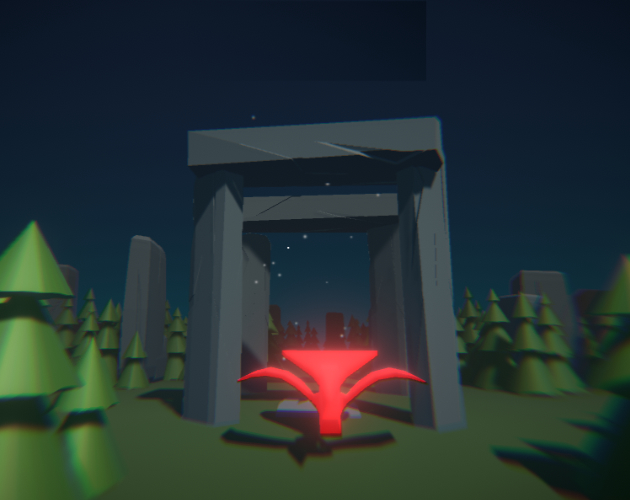
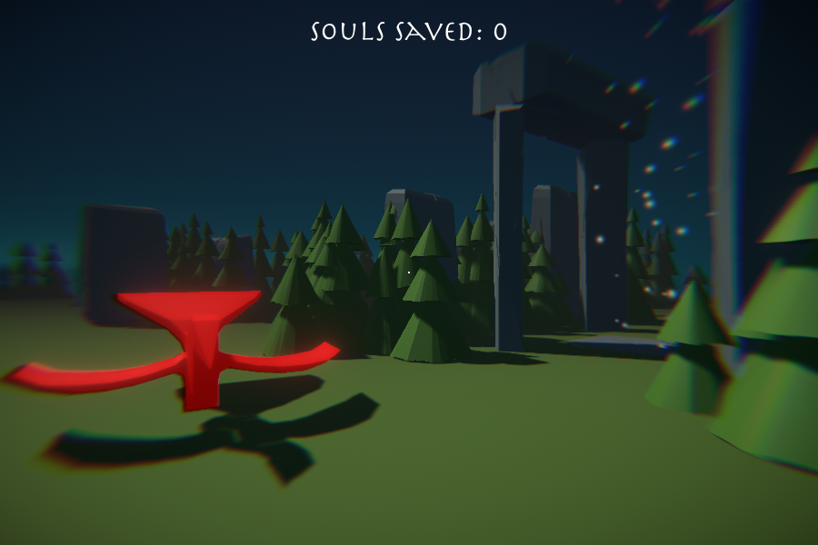
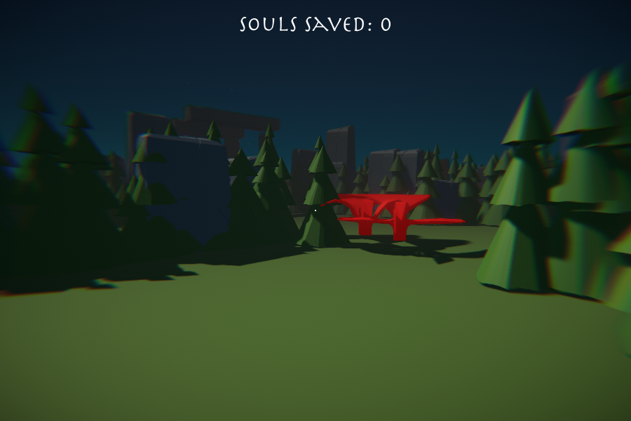
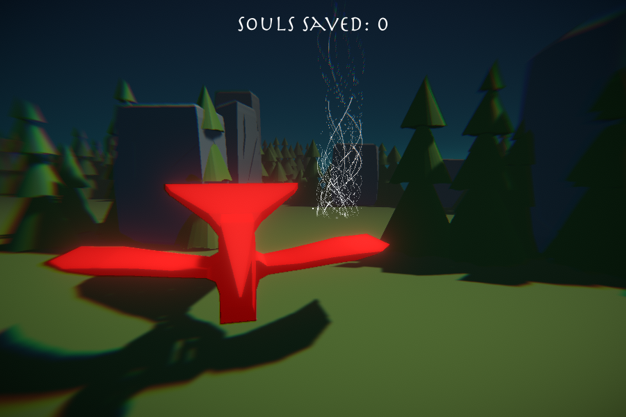
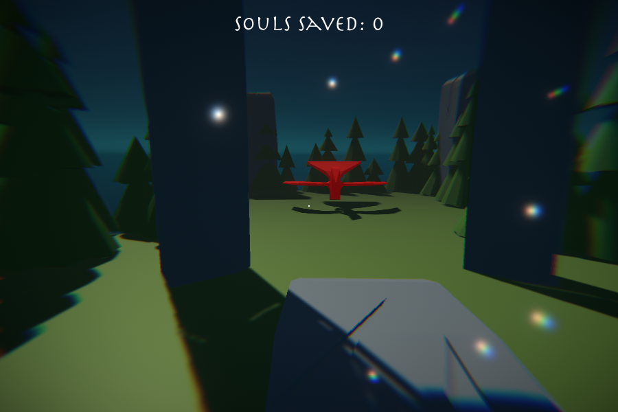
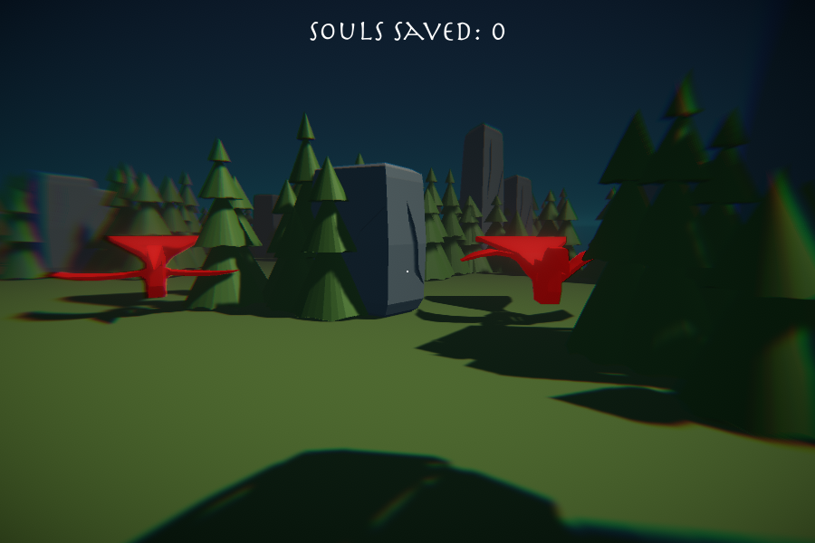

# Death Is Only The Beginning 

The game built for the [GameDev.tv Game Jam 2022](https://itch.io/jam/gamedevtv-jam-2022).

WebGL version is released on the [https://pixelook.itch.io/death-is-only-the-beginning](https://pixelook.itch.io/death-is-only-the-beginning) page.

## Used tools
[Blender](http://blender.org/) - for that super cool models  
[Bfxr](http://bfxr.net/), [ocenaudio](https://www.ocenaudio.com) - for SFX and sounds  
[ecrettmusic](http://ecrettmusic.com/) - for the music  
[Audacity](http://audacityteam.org/) - to make that crazy sounds
[Unity3d](https://unity.com) - hmm...

## Pictures

### Cover

### Maze generator

### From game

